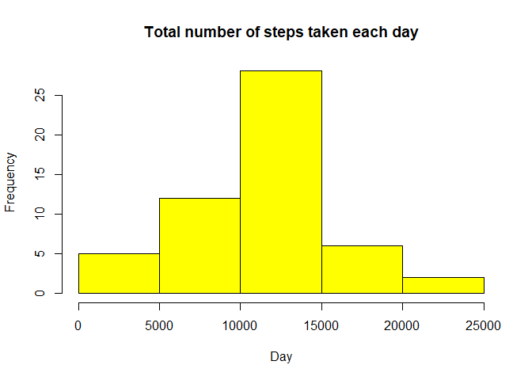
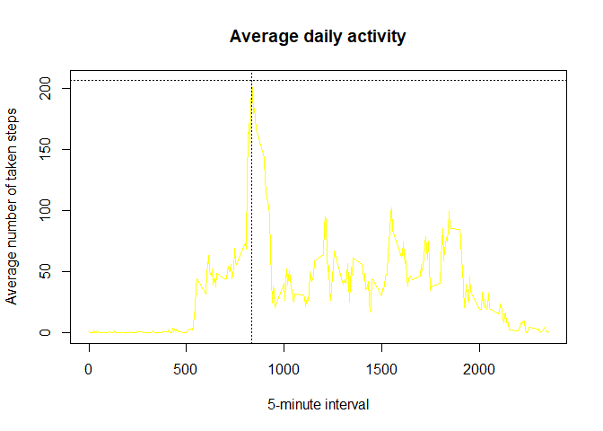
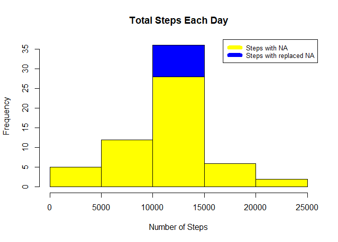
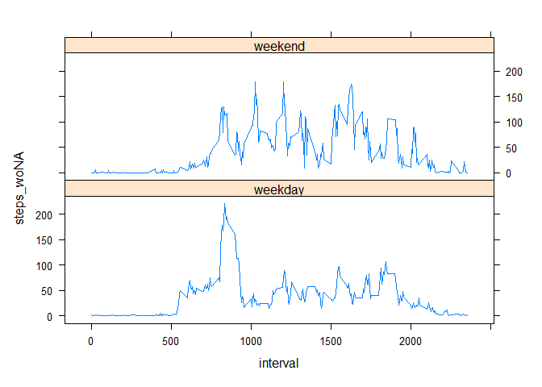

Activity monitoring analysis
================
IS
2022-11-22

## Introduction

It is now possible to collect a large amount of data about personal
movement using activity monitoring devices such as a Fitbit, Nike
Fuelband, or Jawbone Up. These type of devices are part of the
“quantified self” movement – a group of enthusiasts who take
measurements about themselves regularly to improve their health, to find
patterns in their behavior, or because they are tech geeks. But these
data remain under-utilized both because the raw data are hard to obtain
and there is a lack of statistical methods and software for processing
and interpreting the data.

This assignment makes use of data from a personal activity monitoring
device. This device collects data at 5 minute intervals through out the
day. The data consists of two months of data from an anonymous
individual collected during the months of October and November, 2012 and
include the number of steps taken in 5 minute intervals each day.

## Data

The data for this assignment can be downloaded from the course web site:

Dataset: [Activity monitoring
data](https://d396qusza40orc.cloudfront.net/repdata%2Fdata%2Factivity.zip)

The variables included in this dataset are:

**steps:** Number of steps taking in a 5-minute interval (missing values
are coded as NA)

**date:** The date on which the measurement was taken in YYYY-MM-DD
format

**interval:** Identifier for the 5-minute interval in which measurement
was taken

The dataset is stored in a comma-separated-value (CSV) file and there
are a total of 17,568 observations in this dataset.

## Loading and preprocessing the data

On this stage I set directory and use **readr** library to unzip
dataset, and **dplyr** for the whole project

## What is mean total number of steps taken per day?

Number of steps taken per day (first 10 days)

``` r
amdDate<-amd %>% group_by(date) %>% summarise(steps=sum(steps),.groups='drop')
print(amdDate)
```

    ## # A tibble: 61 × 2
    ##    date       steps
    ##    <date>     <dbl>
    ##  1 2012-10-01    NA
    ##  2 2012-10-02   126
    ##  3 2012-10-03 11352
    ##  4 2012-10-04 12116
    ##  5 2012-10-05 13294
    ##  6 2012-10-06 15420
    ##  7 2012-10-07 11015
    ##  8 2012-10-08    NA
    ##  9 2012-10-09 12811
    ## 10 2012-10-10  9900
    ## # … with 51 more rows

Histogram of the total number of steps taken each day

``` r
hist(amdDate$steps,col="yellow", xlab="Day", main="Total number of steps taken each day")
```

<!-- -->

Mean and median of the total number of steps taken per day

``` r
df<-data.frame(Mean_WithNA=mean(amdDate$steps, na.rm=T),Median_WithNA=median(amdDate$steps, na.rm=T))
print(df)
```

    ##   Mean_WithNA Median_WithNA
    ## 1    10766.19         10765

## What is the average daily activity pattern?

``` r
amdInterval <- amd %>% group_by(interval) %>% summarise(meanSteps = mean(steps, na.rm = TRUE))
max_steps <- max(amdInterval$meanSteps)
plot(amdInterval$interval,amdInterval$meanSteps, type="l",col="yellow", xlab="5-minute interval",ylab="Average number of taken steps", main="Average daily activity")
abline(h=max_steps, lty = 3)
abline(v=amdInterval[amdInterval$meanSteps == max(amdInterval$meanSteps),1],lty = 3)
```

<!-- -->

Calculation of 5-minute interval, on average across all the days in the
dataset, contains the maximum number of steps(as seen data correspond to
the plot ):

``` r
  max_interval <- amdInterval[amdInterval$meanSteps == max_steps,1]
  print(paste("Maximum number of avg.steps in a day-",round(max_steps,0), ", Correspondent Interval-",max_interval))
```

    ## [1] "Maximum number of avg.steps in a day- 206 , Correspondent Interval- 835"

## Imputing missing values

According to code:

``` r
sum(!complete.cases(amd))
```

total number of missing values in the dataset

    ## [1] 2304

The task said that we need to fill missed values in dataset and solution
doesn’t have to be sophisticated. So we have 2 quite simple options -
replace NA with average per day or replace NA with average per 5-min
interval. Since in previous calculations we saw that some days has all
steps values - NA, and there is no such inconvenience in 5-min interval,
I decided to chose 2nd solution.

``` r
amdFull <-amd %>% left_join(amdInterval, by = "interval")
amdFull$steps_woNA <- ifelse(is.na(amdFull$steps), amdFull$meanSteps, amdFull$steps)
amdFull<- amdFull[,!names(amdFull) %in% c("meanSteps")]
```

New dataset have 2 fieds with steps values. **steps** - original field
with NA values, **steps_woNA** - field with NA replaced with mean in
correspondent 5-min interval. First 10 rows:

``` r
print(head(amdFull,n=10))
```

    ##    steps       date interval steps_woNA
    ## 1     NA 2012-10-01        0  1.7169811
    ## 2     NA 2012-10-01        5  0.3396226
    ## 3     NA 2012-10-01       10  0.1320755
    ## 4     NA 2012-10-01       15  0.1509434
    ## 5     NA 2012-10-01       20  0.0754717
    ## 6     NA 2012-10-01       25  2.0943396
    ## 7     NA 2012-10-01       30  0.5283019
    ## 8     NA 2012-10-01       35  0.8679245
    ## 9     NA 2012-10-01       40  0.0000000
    ## 10    NA 2012-10-01       45  1.4716981

Histogram of the total number of steps taken each

``` r
amdFullDate<-amdFull %>% group_by(date) %>% summarise(steps=sum(steps),steps_woNA=sum(steps_woNA),.groups='drop')
hist(amdFullDate$steps_woNA, main = "Total Steps Each Day", xlab="Number of Steps", col="blue")
hist(amdFullDate$steps, col="yellow", add=TRUE)
legend("topright", c("Steps with NA", "Steps with replaced NA"), col=c("yellow", "blue"), lwd=8, cex=0.8)
```

<!-- -->

Mean and median total number of steps taken per day

``` r
df<-data.frame(Mean_WithNA=mean(amdFullDate$steps, na.rm=T),Median_WithNA=median(amdFullDate$steps, na.rm=T), 
Mean_with_Replaced_NA=mean(amdFullDate$steps_woNA, na.rm=T),Median_with_Replaced_NA=median(amdFullDate$steps_woNA, na.rm=T))
print(df)
```

    ##   Mean_WithNA Median_WithNA Mean_with_Replaced_NA Median_with_Replaced_NA
    ## 1    10766.19         10765              10766.19                10766.19

According to the calculations above we see, that \*\*mean\* after NA
replacement didn’t change at all (since we replace NA with *mean*) but
*median* little bit increased, since the after replacement number of
most frequently occurring cases also increase due to my logic.

## Are there differences in activity patterns between weekdays and weekends?

Panel plot containing a time series plot of the 5-minute interval and
the average number of steps taken, averaged across all weekday days or
weekend days

``` r
library(lattice)
amdFull$weekdayType <- ifelse(weekdays(amdFull$date) %in% c("Satuday", "Sunday"),"weekend", "weekday")
amdFullW <- amdFull %>% group_by(weekdayType,interval) %>% summarise(steps_woNA = mean(steps_woNA, na.rm = TRUE),.groups='drop')
xyplot(steps_woNA ~ interval | weekdayType,amdFullW, layout=c(1,2),type="l")
```

<!-- -->

On the weekends number of steps bigger in majority of intervals. But
maximum average number of steps across all the days - was done in
weekday.
